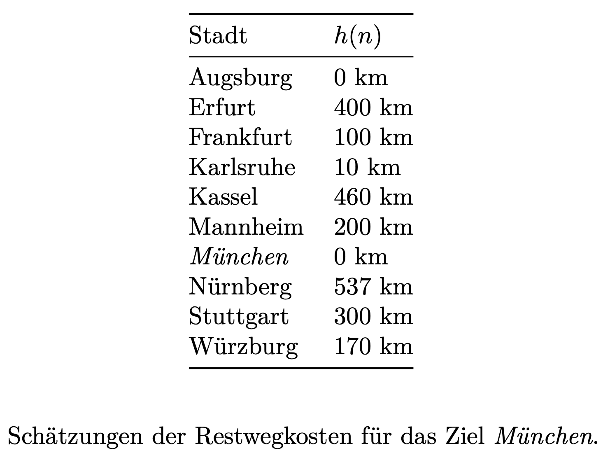

## Suche

Betrachten Sie folgende Landkarte und Restwegschätzungen:

::: center
{width="40%"}

[Quelle: [MapGermanyGraph.svg](https://commons.wikimedia.org/wiki/File:MapGermanyGraph.svg) by [Regnaron](https://de.wikipedia.org/wiki/Benutzer:Regnaron) and [Jahobr](https://commons.wikimedia.org/wiki/User:Jahobr) on Wikimedia Commons ([Public Domain](https://en.wikipedia.org/wiki/en:public_domain))]{.origin}
:::

{width="40%"}

1.  Finden Sie nacheinander mit Tiefensuche und Breitensuche (jeweils in der Graph-Search-Variante)
    sowie A\* (in der Tree-Search-Variante mit der Verbesserung "keine Zyklen", siehe Vorlesung)
    jeweils einen Weg von Würzburg nach München.

    Vergleichen Sie die drei Algorithmen: Wie viele Einträge gibt es in der Datenstruktur maximal,
    wie oft wird die Hauptschleife durchlaufen (also ein Element aus der Datenstruktur entnommen,
    untersucht und weiterentwickelt)?

    Sie können dafür eine Handsimulation anwenden oder die Algorithmen implementieren. Sie können
    gern auch die Java-Klassen im Paket [`aima.core.search`] bzw. die Python-Klassen in [`search.py`]
    als Ausgangspunkt nutzen.[^aima]

2.  Dürfen die oben gegebenen Restkostenabschätzungen in A\* verwendet werden?
    *   Falls ja, warum?
    *   Falls nein, warum? Wie müssten die Abschätzungen ggf. korrigiert werden?

    Falls Sie der Meinung waren, die Abschätzungen sind nicht korrekt, korrigieren Sie die Abschätzungen
    nun und führen Sie erneut eine Suche mit A\* durch.

_Hinweis_: Reihenfolge bei gleichen $f(n)$-Kosten: alphabetische Reihenfolge, d.h. Mannheim käme
vor München, Karlsruhe vor Kassel etc.

[`aima.core.search`]: https://github.com/aimacode/aima-java/tree/AIMA3e/aima-core/src/main/java/aima/core/search
[`search.py`]: https://github.com/aimacode/aima-python/blob/master/search.py
[^aima]: Im Python-Code tauchen immer wieder "TODO"-Marker auf - bitte mit Vorsicht genießen!
