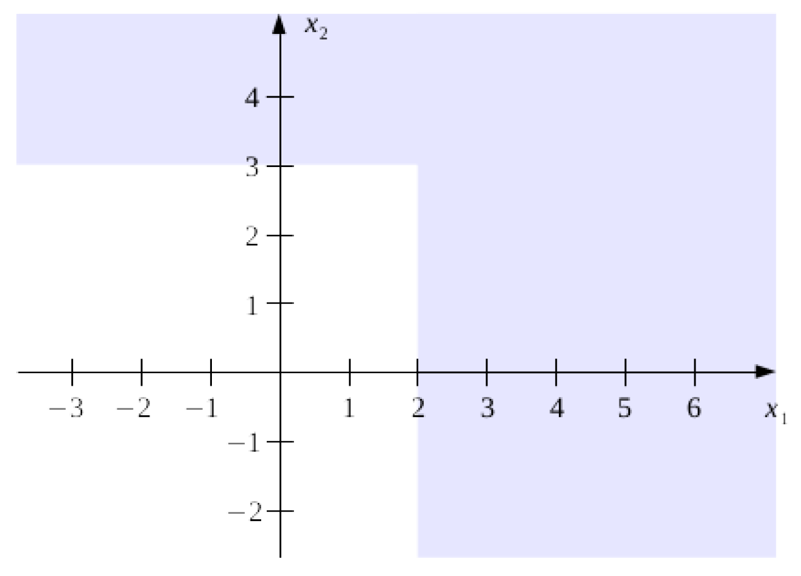

## A8.1: Lineares MLP (2P)

Gegeben sei ein MLP mit linearen Aktivierungsfunktionen, d.h. für jedes Neuron berechnet sich der Output durch die gewichtete Summe der Inputs: $ y = g(w^T x) $, wobei $ g(z) = z $ gilt, also $ y = w^T x $.
Zeigen Sie, dass dieses Netz durch eine einzige Schicht mit linearen Neuronen ersetzt werden kann. Betrachten Sie dazu ein zweilagiges Netz bestehend aus einer Ausgabe- und einer versteckten Schicht.

*Thema*: Verständnis Bedeutung nichtlinearer Aktivierungsfunktionen

## A8.2: Perzeptron-Netze (2P)

Konstruieren Sie ein Netz mit drei Perzeptrons, welches für zwei Eingabevariablen x1 und x2 die in der folgenden Abbildung blau-grau dargestellten Bereiche mit +1 klassifiziert. Benutzen Sie die sign-Funktion als Aktivierungsfunktion.

{width="80%"}

## A8.3: Tensorflow Playground (4P)

**TODO**

### Winter 2022

Benutzen Sie den [Neural Network Playground](https://playground.tensorflow.org/) um die unten gelisteten Experimente durchzuführen. Achten Sie bei allen Experimenten auf das Verhalten der Trainings- und Testkosten. Sie können mit Hilfe der Checkbox unter der Ausgabezelle (ganz rechts, unten) die Testdaten ein- und ausblenden. Der Play-Knopf startet dabei das Training und der Reload-Knopf setzt das Netzwerk zurück.

1.  Trainieren Sie ein logistisches Regressionsmodell auf dem "Gaussian" Datensatz (linear separierbarer Datensatz, links-unten).
    *   Fügen Sie dem Datensatz etwas Rauschen (Noise) hinzu und trainieren Sie erneut. Wie verhalten sich die Kosten? Warum?
    *   Können Sie eine Überanpassung dieses Modells erreichen?
    *   Trainieren Sie das Modell auf den anderen Datensätzen. Wie verhalten sich die Kosten? Warum?

2.  Trainieren Sie folgende MLPs auf dem kreisförmigen Datensatz (Circle) mehrmals mit jeweils den Aktivierungsfunktionen ReLU, tanh und Sigmoid:
    *   MLP mit einer versteckten Schicht mit zwei Neuronen. Erhöhen Sie schrittweise die Anzahl der Neuronen in der versteckten Schicht auf drei, vier und zuletzt auf fünf.
    *   MLP mit vier Schichten, mit jeweils 6 Zellen pro Schicht.

3.  Trainieren Sie ein Netzwerk mit zwei versteckten Schichten mit jeweils 6 Neuronen einige Male auf dem spiralförmigen Datensatz (rechts unten).
    *   Wie viele Epochen dauert das Training? Beobachten Sie Trainings- und Testkosten: liegt eine Überanpassung vor?
    *   Untersuchen Sie die Ausgaben der einzelnen Zellen, in dem Sie die Maus über die jeweilige Zelle bewegen.
        Bemerken Sie einen wesentlichen Unterschied in den Ausgaben der ersten Schicht im Vergleich zu der zweiten Schicht?
    *   Erhöhen Sie die Schichtanzahl auf drei, mit jeweils 7 Neuronen pro Schicht.
        Was können Sie über die Trainingszeit und Kosten sagen? Untersuchen und vergleichen Sie wieder die Ausgaben der Zellen in den drei Schichten.

Beantworten Sie für alle Experimente folgende Fragen:

*   Wie verhält sich die Entscheidungsgrenze?
*   Was können Sie über Trainings- und Testkosten sagen? Entsteht eine Überanpassung?
*   Wie schnell wird die Entscheidungsgrenze berechnet?
*   Können alle Datenpunkte jedes mal korrekt klassifiziert werden?
*   Hat die Auswahl der Aktivierungsfunktion einen Einfluss auf die Form der Entscheidungsgrenze oder die Geschwindigkeit der Berechnung?
*   Setzen Sie nun den Noise-Level auf 15 und wiederholen Sie die Experimente. Wann kann von einer Überanpassung gesprochen werden?

### Winter 2021
Benutzen Sie den [Neural Network Playground](https://playground.tensorflow.org/) um folgende Experimente durchzuführen.

*   (2P) Stellen Sie ein MLP mit einer versteckten Schicht mit zwei Neuronen auf. Trainieren Sie das Netzwerk auf dem kreisförmigen Datensatz (Circle) mehrmals mit jeweils den Aktivierungsfunktionen ReLU, tanh und Sigmoid. Der Play-Knopf startet dabei das Training und der Reload-Knopf setzt das Netzwerk zurück.

    *   Was passiert, wenn Sie die Anzahl der Neuronen in der versteckten Schicht auf drei erhöhen? Wie schaut die Entscheidungsgrenze aus? Wie schnell wird sie berechnet? Können alle Datenpunkte jedes mal korrekt klassifiziert werden?
    *   Erhöhen Sie die Anzahl der Schichten auf vier, mit jeweils 6 Zellen pro Schicht. Wie ändert sich dadurch die Entscheidungsgrenze? Was können Sie über Trainings- und Testkosten sagen? Entsteht eine Überanpassung?
    *   Setzen Sie nun den Noise-Level auf 15 und wiederholen Sie das Training. Kann von einer Überanpassung gesprochen werden? Hinweis: Sie können mit Hilfe der Checkbox unter der Ausgabezelle die Testdaten ein- und ausblenden.

*   (2P) Trainieren Sie ein Netzwerk mit zwei versteckten Schichten mit jeweils 6   Neuronen einige Male auf dem spiralförmigen Datensatz (rechts unten).

    *   Wie viele Epochen dauert das Training? Beobachten Sie Trainings- und Testkosten: liegt eine Überanpassung vor?
    *   Untersuchen Sie die Ausgaben der einzelnen Zellen, in dem Sie die Maus über die jeweilige Zelle bewegen. Bemerken Sie einen wesentlichen Unterschied in den Ausgaben der ersten Schicht im Vergleich zu der zweiten Schicht?
    *   Erhöhen Sie die Schichtanzahl auf drei, mit jeweils 7 Neuronen pro Schicht. Was können Sie über die Trainingszeit und Kosten sagen? Untersuchen und vergleichen Sie wieder die Ausgaben der Zellen in den drei Schichten.

*Thema*: Verständnis Auswirkung der Hyperparameter eines MLP auf das Ergebnis

## A8.4: Vorwärtslauf im MLP (2P)

Gegeben sei ein MLP mit 25 Zellen in der Eingangsschicht, 64 Zellen in der ersten versteckten Schicht, 32 Zellen in der zweiten versteckten Schicht und 4 Zellen in der Ausgabeschicht (die Bias-Zellen nicht mitgezählt). In allen Zellen wird die ReLU Aktivierungsfunktion verwendet.

*   Was sind die Dimensionen der Gewichtsmatrizen $W^{[1]}$, $W^{[2]}$ und $W^{[3]}$ und der Bias-Vektoren $b^{[1]}$, $b^{[2]}$ und $b^{[3]}$?
*   Wie wird die Ausgabe berechnet? Schreiben Sie den Vorwärtslauf in Matrix-Notation auf. Wie könnte man die Ausgabe deuten; welches Problem könnte durch dieses Netzwerk möglicherweise gelöst werden?

*Thema*: MLP Vorwärtslauf
