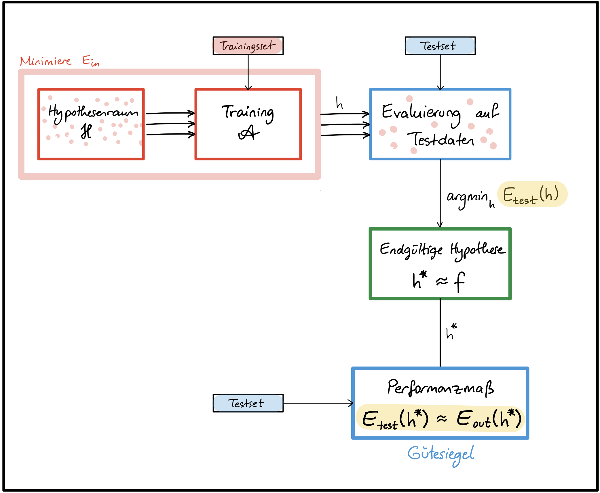
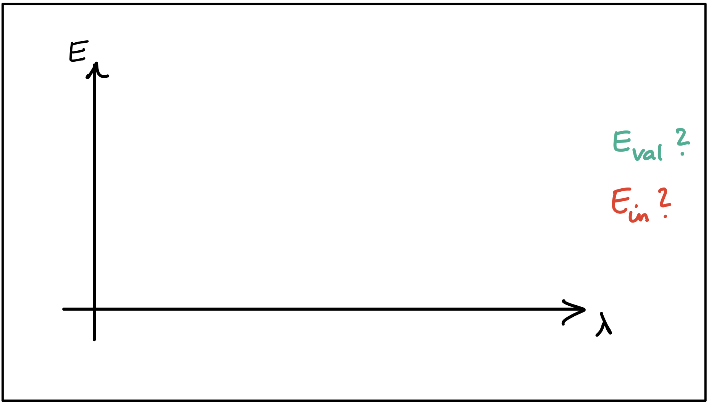
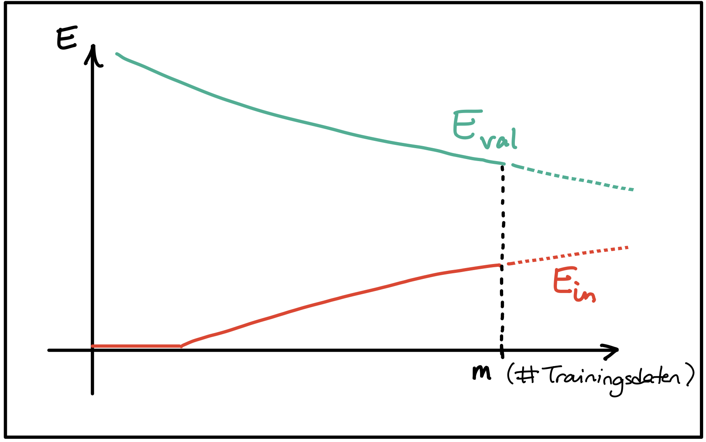

## A10.1: Fehlerhafter Einsatz der Testdaten (2P)
Wo genau liegt das Problem in dem folgenden Lernszenario in Abbildung 1?
Geben Sie eine ausführliche Beschreibung.

{width="80%"}

*Thema*: Verständnis "**Data Leakage**" im Lernprozess

## A10.2: Regularisierungsparameter (2P)

Sie haben ein relativ komplexes Neuronales Netzwerk für Ihr Klassifizierungsproblem gewählt und möchten dafür einen guten Regularisierungsparameter $\lambda$ bestimmen (fine-tuning).
Dazu trainieren Sie Ihr Modell mehrfach, jeweils mit unterschiedlichen $\lambda$-Werten und beobachten Trainings- und Validierungsfehler.

Wie könnten sich die Kurven von $E_{in}$ und $E_{val}$ mit steigendem $\lambda$ verhalten? Zeichnen Sie die Kurven ungefähr ein (siehe Abbildung 2). Wie würden Sie folglich Ihre Auswahl treffen?

*Hinweis*: Betrachten Sie die Grenzfälle $\lambda = 0$ und $\lambda \rightarrow \infty$

{width="80%"}

*Theme*: Verhalten von $E_{in}$ und $E_{val}$ in Abhängigkeit von $\lambda$

## A10.3: Lernkurven (4P)

Sie haben Ihr Modell mit Trainingsmengen unterschiedlicher Größe ($m=1, m=2, m=5, ...$) trainiert und die Fehler $E_{in}$ und $E_{val}$ beobachtet.

*   (1P) Was können Sie aus der Graphik in Abbildung 3 schließen? Was ist das Problem?
*   (1P) Wie verhalten sich $E_{in}$ und $E_{val}$ (relativ zueinander) für $m \rightarrow \infty$?
*   (2P) Was wären mögliche Lösungsalternativen? Wie würden sich diese Lösungen auf die Kurven in Abbildung 3 auswirken? Warum?

{width="80%"}

*Theme*: Verhalten von $E_{in}$ und $E_{val}$ in Abhängigkeit von der Anzahl an Trainingsdaten

## A10.4: Trainingsfehler (2P)

Geben Sie an ob die folgende Aussage zutrifft und begründen Sie Ihre Antwort.

> Mit der Erhöhung der Anzahl von Trainingsdaten würden wir einen Abstieg in dem Trainingsfehler $E_{in}$ beobachten, denn das Modell würde von mehr Daten besser lernen können und in einer besseren endgültigen Hypothese resultieren.

*Thema*: Verhalten der Trainingskosten in Abhängigkeit von der Anzahl an Trainingsdaten
