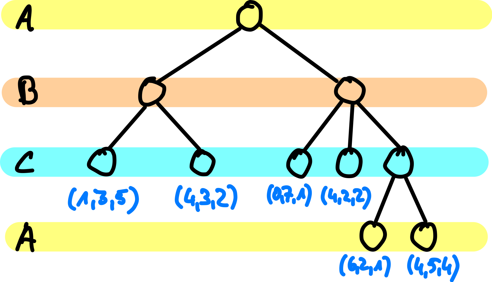

## Wenn die Zeit nicht reicht: Suchtiefe begrenzen

*   Einführung neuer Funktionen:
    1.  `Cutoff-Test` statt `Terminal-Test`

        Beispielsweise bei erreichter Tiefe oder Zeitüberschreitung

    \smallskip

    2.  `Eval` statt `Utility`

        Bewertung der erreichten Position (statt nur Bewertung des Endzustandes)

\bigskip

*   Bedingungen an `Eval`:
    1.  Endknoten in selber Reihenfolge wie bei `Utility`
    2.  Schnell zu berechnen (!)

## Beispiel Schach

*   Mögliche Evaluierungskriterien:
    *   Materialwert: Bauer 1, Läufer/Springer 3, Turm  5, Dame 9
    *   Stellungsbewertung: Sicherheit des Königs, Stellung der Bauern
    *   Daumenregeln: 3 Punkte Vorteil => sicherer Sieg

\smallskip

*   Nutzung gewichteter Features
    $f_i$: \quad $\operatorname{Eval}(s) = w_1f_1(s) + w_2f_2(s) + \ldots$

    *   [Beispiel: ]{.notes}  $w_1 = 9$ und $f_1(s)$ = (# weiße Königinnen) - (# schwarze Königinnen)

\bigskip

*   **Alternativ**: Speicherung von Positionen plus Bewertung in Datenbanken \newline
    => Lookup mit $\operatorname{Eval}(s)$ [(statt Berechnung zur Laufzeit)]{.notes}

## Minimax mit mehreren Spielern

\pause

::: center
{width="90%"}

[Quelle: "Artificial Intelligence: A Modern Approach (Figures from text)" [@Russell2020figs, Fig. 5.4, S. 42], Wiedergabe mit freundlicher Erlaubnis der Autoren]{.origin}
:::

::: notes
Hier maximiert jeder Spieler sein eigenes Ergebnis. Wenn es an einer Stelle im Suchbaum mehrere gleich gute (beste) Züge
geben sollte, kann der Spieler Allianzen bilden: Er könnte dann einen Zug auswählen, der für einen der Mitspieler günstiger
ist.
:::

## Zufallsspiele

::: center
{width="50%"}

[Quelle: "Artificial Intelligence: A Modern Approach (Figures from text)" [@Russell2020figs, Fig. 5.12, S. 47], Wiedergabe mit freundlicher Erlaubnis der Autoren]{.origin}
:::

Backgammon: Weiss hat 6+5 gewürfelt und hat 4 legale Züge.

## Minimax mit Zufallsspielen: ZUFALLS-Knoten

::: center
{width="80%"}

[Quelle: "Artificial Intelligence: A Modern Approach (Figures from text)" [@Russell2020figs, Fig. 5.13, S. 48], Wiedergabe mit freundlicher Erlaubnis der Autoren]{.origin}
:::

::: notes
Zusätzlich zu den MIN- und MAX-Knoten führt man noch Zufalls-Knoten ein, um
das Würfelergebnis repräsentieren zu können. Je möglichem Würfelergebnis $d_i$
gibt es einen Ausgang, an dem die Wahrscheinlichkeit $P(d_i)$ dieses Ausgangs
annotiert wird.
:::

=> Für Zufallsknoten *erwarteten* Minimax-Wert (*Expectimax*) nutzen

## Minimax mit Zufall: Expectimax

Expectimax-Wert für Zufallsknoten $C$ (für `Max`-Spieler):

$$
    \operatorname{Expectimax}(C) = \sum_i P(d_i) \max_{s \in S(C,d_i)} \operatorname{Utility}(s)
$$

\bigskip

*   $d_i$ mögliches Würfelergebnis
*   $P(d_i)$ Wahrscheinlichkeit für Würfelergebnis
*   $S(C,d_i)$ Erreichbare Spielzustände von $C$ aus (gegeben $d_i$)
*   $\operatorname{Utility}(s)$ Bewertung von Spielzustand $s$

## Wrap-Up

*   Minimax:
    *   Kriterien zur Begrenzung der Suchtiefe, Bewertung `Eval` statt `Utility`
    *   Erweiterung auf $>2$ Spieler
    *   Erweiterung auf Spiele mit Zufall: *Expectimax*

<!-- DO NOT REMOVE - THIS IS A LAST SLIDE TO INDICATE THE LICENSE AND POSSIBLE EXCEPTIONS (IMAGES, ...). -->
::: slides
## LICENSE

Unless otherwise noted, this work is licensed under CC BY-SA 4.0.

### Exceptions
*   TODO (what, where, license)
:::
