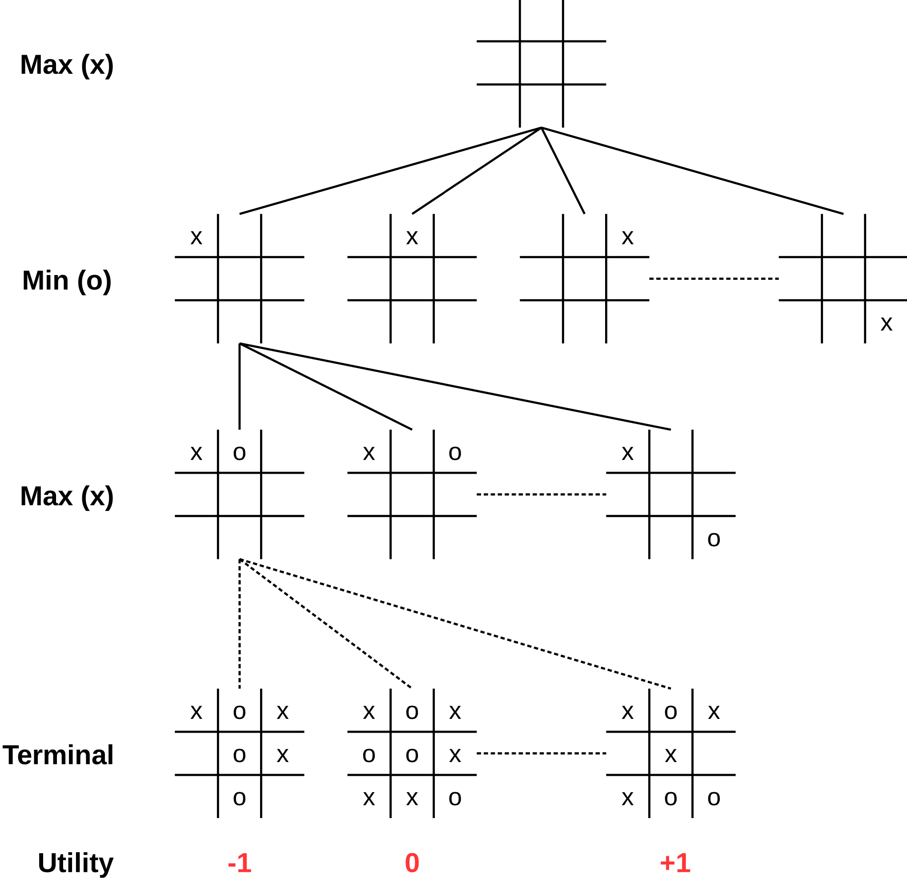
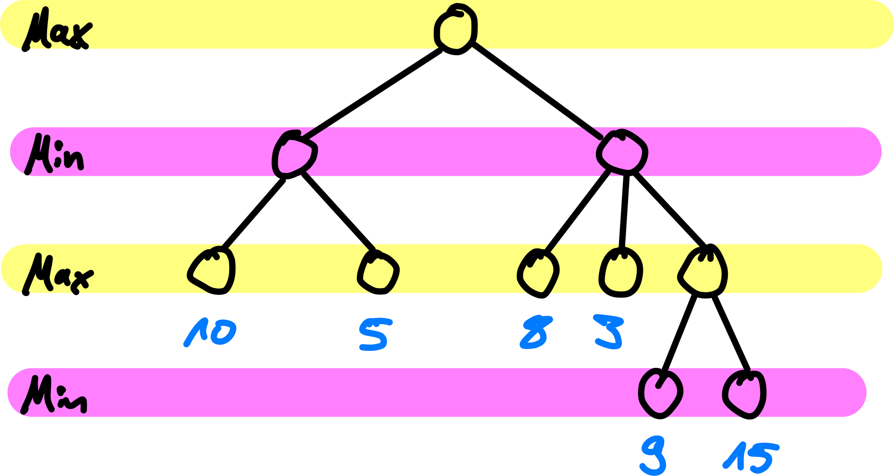

## Spiele als Suchproblem: Minimax

::: notes
### Terminologie

*   Zwei abwechselnd spielende Spieler: `MAX` und `MIN`, wobei `MAX` beginnt
    *   Beide Spieler spielen in jedem Zug [optimal]{.alert}
    *   Spielergebnis wird aus Sicht von `MAX` bewertet:
        *   $+1$, wenn Spieler `MAX` gewinnt
        *   $-1$, wenn Spieler `MIN` gewinnt
        *   $0$, wenn unentschieden
    *   Spieler `MAX` versucht, das Spielergebnis zu **maximieren**
    *   Spieler `MIN` versucht, das Spielergebnis zu **minimieren**

*   Startzustand: Initialer Zustand des Spielbrettes
*   Aktionen: Legale Züge, abhängig vom Spielzustand
*   Zieltest: Ist das Spiel vorbei?

    => Startzustand und anwendbare Aktionen definieren den Zustandsraum.

*   Nutzenfunktion: $\operatorname{UTILITY}(s,p)$: Wert des Spiels für
    Spieler $p$ im Spielzustand $s$

*   Strategie: Spieler benötigen **Strategie**, um zu gewünschtem Endzustand
    zu kommen *(unabhängig von den Entscheidungen des Gegenspielers)*
    => einfacher Pfad von Start zu Ziel reicht nicht

*Hinweis*: Nullsummenspiel! (Der Gewinn des einen Spielers ist der Verlust des
anderen Spielers.)

Eine mit dem Minimax-Algorithmus berechnete Strategie wird auch
*Minimax-Strategie* genannt. Sie sichert dem betreffenden Spieler den
höchstmöglichen Gewinn, der **unabhängig** von der Spielweise des Gegners
erreichbar ist.

Bei Nicht-Nullsummenspielen, bei denen die Niederlage des Gegners nicht
zwangsläufig mit dem eigenen Gewinn zusammenfällt (d.h. Gewinn des einen
Spielers $\ne$ Verlust des anderen Spielers), liefert der Minimax-Algorithmus
nicht unbedingt eine optimale Strategie.


### Spielbaum TTT
:::

::: center
{width="50%"}
:::


::: notes
### Minimax (Idee)

1)  Erzeuge kompletten Suchbaum mit Tiefensuche
2)  Wende Nutzenfunktion (*Utility*) auf jeden Endzustand an
3)  Ausgehend von Endzuständen => Bewerte Vorgängerknoten:
    *   Knoten ist `Min`-Knoten: \newline
        Nutzen ist das **Minimum** der Kindknoten
    *   Knoten ist `Max`-Knoten: \newline
        Nutzen ist das **Maximum** der Kindknoten
4)  Startknoten: `Max` wählt den Zug, der zum Nachfolger mit der
    höchsten Bewertung führt

*Annahme*: Beide spielen perfekt. Fehler verbessern das Resultat für den Gegner.
:::


## Minimax-Algorithmus: Funktionen für MAX- und MIN-Knoten

```python
def Max-Value(state):
    if Terminal-Test(state): return Utility(state)

    v = -INF
    for (a, s) in Successors(state):
        v = MAX(v, Min-Value(s))
    return v
```

\bigskip

```python
def Min-Value(state):
    if Terminal-Test(state): return Utility(state)

    v = +INF
    for (a, s) in Successors(state):
        v = MIN(v, Max-Value(s))
    return v
```

::: notes
**Hinweis I**: Auf [wikipedia.org/wiki/Minimax](https://en.wikipedia.org/wiki/Minimax#Pseudocode)
finden Sie eine Variante mit einem zusätzlichen Tiefenparameter, um bei einer bestimmten
Suchtiefe abbrechen zu können. Dies ist bereits eine erweiterte Version, wo man beim
Abbruch durch das Erreichen der Suchtiefe statt `Utility()` eine `Eval()`-Funktion
braucht (vgl. `["Minimax: Heuristiken"]()`{=markdown}).

Wenn man ohne Suchtiefenbeschränkung arbeiten will, braucht man diesen
Parameter nicht! Der Algorithmus terminiert auch ohne Suchtiefenbeschränkung!


**Hinweis II**: Im [@Russell2020, S. 196, Abb. 6.3] findet sich eine Variante, die die
auf der nächsten Folien gezeigte Startfunktion mit den hier gezeigten `Min-Value()`-
und `Max-Value()`-Funktionen verschmilzt. Dabei wird in den beiden Hilfsfunktionen
nicht nur der `min`- bzw. `max`-Wert optimiert, sondern auch der jeweils beste Zug
gespeichert und als Rückgabe zurückgeliefert.
:::


## Minimax-Algorithmus: Sonderbehandlung Startknoten

```python
def Minimax(state):
    (val, action) = (-INF, null)
    for (a, s) in Successors(state):
        v = Min-Value(s)
        if (val <= v):
            (val, action) = (v, a)
    return action
```

::: notes
*   Startknoten ist ein MAX-Knoten
*   Nicht nur Kosten, sondern auch die zugehörige Aktion speichern
:::


## Minimax Beispiel

{width="60%"}

[Tafelbeispiel Handsimulation]{.bsp}


::: notes
### Aufwand Minimax

*   maximale Tiefe des Spielbaums: $m$
*   in jedem Zustand $b$ gültige Züge
*   => Zeitkomplexität $O(b^m)$

\bigskip

Gedankenexperiment:
-   erster Zug: $b$ Möglichkeiten,
-   zweiter Zug: jeweils wieder $b$ Möglichkeiten $\rightarrow$ $b \star b = b^2$,
-   dritter Zug: jeweils wieder $b$ Möglichkeiten $\rightarrow$ $b \star (b \star b) = b^3$,
-   ...,
-   $m$. Zug: jeweils wieder $b$ Möglichkeiten $\rightarrow$ $b^m$
:::


## Wrap-Up

*   Minimax: Entwickelt Spielbaum, bewertet Zustände entsprechend `Max` und `Min`
    -   Gewinn von `Max`: +1, Gewinn von `Min`: -1
    -   `Max` wählt das Maximum der möglichen Züge von `Min`
    -   `Min` wählt das Minimum der möglichen Züge von `Max`
    -   Spielbaum wird bis zu den Blättern entwickelt, Bewertung mit `Utility`


<!-- DO NOT REMOVE - THIS IS A LAST SLIDE TO INDICATE THE LICENSE AND POSSIBLE EXCEPTIONS (IMAGES, ...). -->
::: slides
## LICENSE


Unless otherwise noted, this work is licensed under CC BY-SA 4.0.
:::
