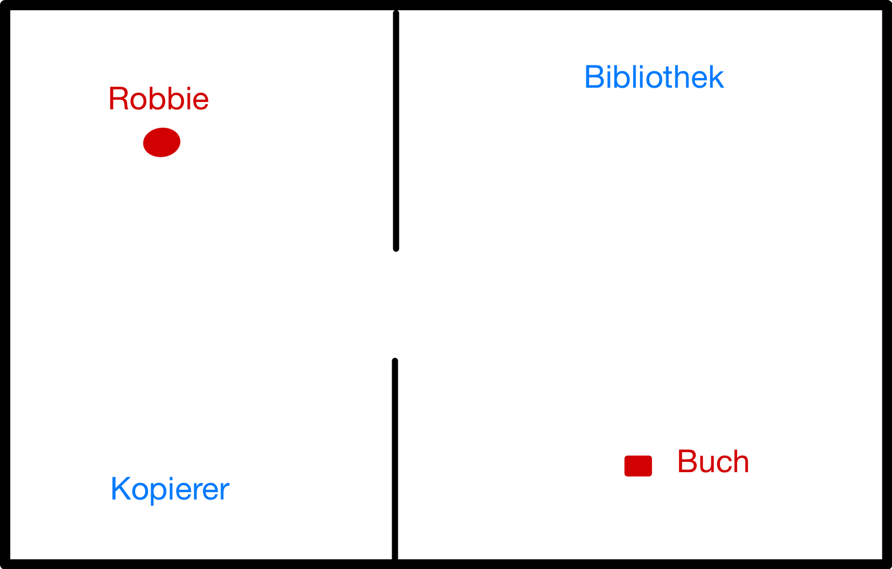
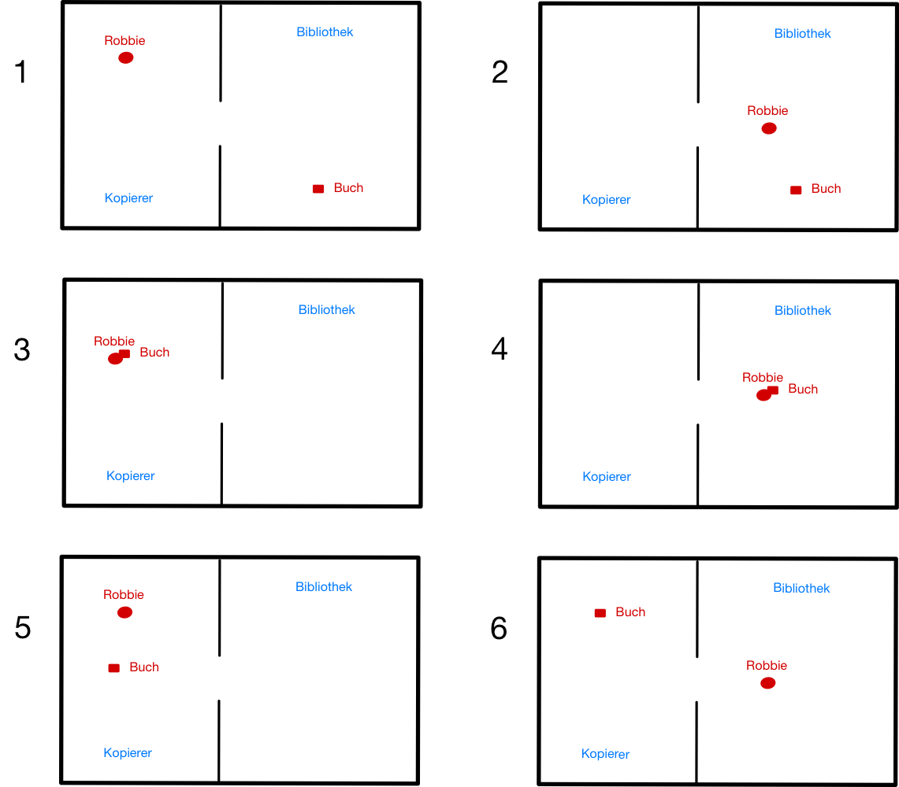
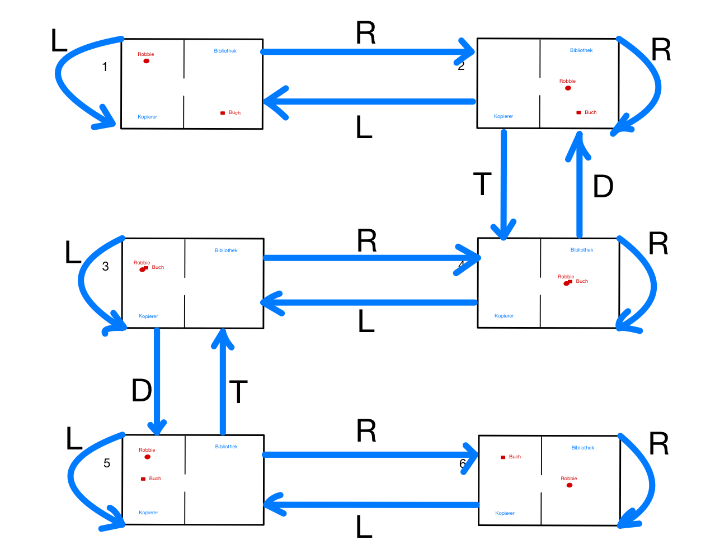

## Motivation: Roboter in einer Bibliothek

::: center
{width="40%"}
:::

\pause
\bigskip
\smallskip

:::::: columns
::: {.column width="45%"}
**Aktionen:**

*   Right (R)
*   Left  (L)
*   Take  (T)
*   Drop  (D)
:::
::: {.column width="45%"}
**Wahrnehmungen:**

*   In welchem Raum bin ich?
*   Habe ich das Buch?
:::
::::::

\bigskip

**Aufgabe:** Das Buch aus der Bibliothek holen und in den Kopiererraum bringen.

[Hinweis Agent, Umwelt, Modellierung]{.bsp}

::: notes
Bemerkungen zur Umwelt:

*   Beobachtbarkeit der Umwelt kann variieren: "voll beobachtbar" bis zu "unbeobachtbar"
*   Umwelt kann "deterministisch" oder "stochastisch" sein: Führt eine Aktion in
    einem Zustand immer zum selben Folgezustand?
*   Wann erfolgt die Rückmeldung an den Agenten über die Auswirkung der
    Aktionen? Sofort ("sequentiell") oder erst am Ende einer Aktionsfolge
    ("episodisch")?
*   Wird die Umwelt nur durch die Aktionen des Agenten verändert ("statisch")?
    Oder verändert sich die Umwelt zwischen den Aktionen eines Agenten,
    beispielsweise durch andere Agenten ("dynamisch")?
*   Gibt es diskrete Zustände (wie im Beispiel)?
:::

## Zustände der Bibliotheks-Welt

::: center
{width="55%"}
:::

\bigskip

**Problem:** Gegeben einen Startzustand, wie komme ich zum Ziel?

::: notes
*   Welche Aktionen können in einem Zustand (zb. Nr. 4) angewendet werden?
*   Welche Aktionen können in den Folgezuständen angewendet werden?

Ergebnis:

*   Zustandsraum: Menge aller von den Startzuständen aus erreichbaren Zustände
*   Problemgraph: Repräsentation der Zustände und Aktionen als Knoten und (gerichtete) Kanten
:::

## Suche im Problemgraphen

::: center
{width="60%"}
:::

[Tafel: Skizze Suchbaum, mit und ohne Wdhlg.]{.bsp}

::: notes
*   Durch die Suche im Problemgraphen wird ein Suchbaum aufgespannt
*   Varianten: Zustände können in einem Pfad wiederholt vorkommen vs.
    Wiederholungen werden ausgeschlossen
:::

## Definition Zustand und Aktion

**Zustand:**
:   (Formale) Beschreibung eines Zustandes der Welt

**Aktion:**
:   (Formale) Beschreibung einer durch Agenten ausführbaren Aktion

    *   Anwendbar auf bestimmte Zustände
    *   Überführt Welt in neuen Zustand ("Nachfolge-Zustand")

\bigskip
\bigskip

[**Geeignete Abstraktionen wählen für Zustände und Aktionen!**]{.alert}

::: notes
**Anmerkung:**
[@Russell2020] unterscheidet zw. Aktionen und Transitionsmodell; hier nur Aktionen!
D.h. die Aktionen und das Übergangsmodell aus dem [@Russell2020] werden direkt zusammen
betrachtet. Bei den hier diskutierten Problemen ist das ohne Nachteile möglich, es
wird lediglich etwas Flexibilität genommen bzw. Komplexität vermieden (je nach Sichtweise :-) ...
:::

## Definition Problem

::: notes
Ein Problem besteht aus:
:::

**Startzustände**
:   Menge $S_A \subset S$

**Aktionen**
:   Menge von Funktionen $\operatorname{op}: S \to S$

**Zustandsraum**
:   Menge aller Zustände $S$, die durch (wiederholte) Anwendung von Aktionen
    von den Startzuständen aus erreichbar sind

\bigskip

**Zieltest**
:   Funktion $\operatorname{goal}: S \to \{0,1\}$

**Zielzustände**
:   Menge $S_E \subseteq S$ mit $\forall x \in S_E : \operatorname{goal}(x)=1$

\bigskip

**Kosten**
:   **Gesamtkosten**: $f(n) = g(n) + h(n)$

    ::: notes
    *   $n \in S$ auf dem aktuellen Weg erreichter Knoten
    *   $g(n)$ tatsächliche Kosten für den Weg vom Start bis zu Knoten $n$
    *   $h(n)$ geschätzte Restkosten für den Weg von Knoten $n$ zum Ziel
    :::

::: notes
## Hinweis: Unterschied Zustand und Knoten bzw. Zustandsraum und Problemgraph

*   Zustände und Aktionen kann man als einen Graph darstellen: **Problemgraph**
    *   Zustände werden als Knoten im Graphen abgebildet
    *   Aktionen werden als (gerichtete) Kanten im Graphen abgebildet
*   Unterscheidung "Zustand" und "Knoten":
    *   Zustand: Beschreibung/Modellierung eines Zustandes der Welt
    *   Knoten: Datenstruktur, Bestandteil des Graphen,
        *symbolisiert* einen Zustand

Das bedeutet, dass der Problemgraph eine Repräsentation des Zustandsraumes ist.

Die beiden Begriffe werden normalerweise synonym verwendet, sofern eindeutig ist,
was gemeint ist.
:::

## Definition Problemlösen

Problemlösen
:   Wegesuche im Graph vom Startknoten zu einem Zielknoten

    *   Spannt den **Suchbaum** auf

\bigskip

**Lösung**
:   Folge von Aktionen, die Start- in Zielzustand überführen

    [Ergebnis des Problemlösens]{.notes}

## Suche: Einfache Basisvariante

1.  Füge Startknoten in leere Datenstruktur (Stack, Queue, ...) ein
2.  Entnehme Knoten aus der Datenstruktur:
    -   Knoten ist gesuchtes Element: Abbruch, melde "*gefunden*"
    -   Expandiere alle Nachfolger des Knotens und füge diese in die
        Datenstruktur ein
3.  Falls die Datenstruktur leer ist: Abbruch, melde "*nicht gefunden*"
4.  Gehe zu Schritt 2

::: notes
Für die in dieser Veranstaltung betrachteten deterministischen Probleme mit
diskreten Zuständen ist diese Basisvariante der Suche eine Art generischer
Suchalgorithmus: Durch die Variation der eingesetzten Datenstruktur und durch
die Betrachtung unterschiedlicher Kosten erhält man die in den nächsten
Sitzungen betrachteten verschiedenen klassischen Suchalgorithmen.

**Anmerkung**: Für Handsimulation besserer Überblick, wenn statt der Knoten
immer **partielle Wege** in Datenstruktur gespeichert werden!

**Anmerkung**: Im [@Russell2020, Abschnitt 3.3.3, S.92] wird ein Algorithmus
mit den vorgestellten Eigenschaften als "**tree-like search**" bezeichnet.
In Anlehnung an [@Russell2020] wird diese Basisvariante der Suche in dieser
Lehrveranstaltung kurz als "Tree-Search"-Algorithmus bezeichnet.

**Anmerkung**: Im [@Russell2020] wird für die Datenstruktur, mit der die
Suche arbeitet, auch "*Frontier*" genannt. Hier werden alle Knoten gehalten,
die in einem der nächsten Schritte betrachtet werden sollen, d.h. diese Knoten
bilden die Grenze zwischen dem bereits untersuchten Teil des Graphen und dem
noch unbekannten Teil des Graphen (deshalb auch "Frontier").
:::

[Tafel: Bezug zum Bibliotheks-Beispiel]{.bsp}

## Erweiterung der Suche: Vermeiden von Wiederholungen

1.  Füge Startknoten in leere Datenstruktur (Stack, Queue, ...) ein
2.  Entnehme Knoten aus der Datenstruktur:
    -   Knoten ist gesuchtes Element: Abbruch, melde "*gefunden*"
    -   Markiere aktuellen Knoten, und
    -   Expandiere alle Nachfolger des Knotens und füge alle unmarkierten
        Nachfolger, die noch nicht in der Datenstruktur sind, in die
        Datenstruktur ein
3.  Falls die Datenstruktur leer ist: Abbruch, melde "*nicht gefunden*"
4.  Gehe zu Schritt 2

::: notes
Dieser Algorithmus ist eine Erweiterung der einfachen Basisvariante der
Suche:
1.  Man markiert bereits besuchte (expandierte) Knoten und besucht diese nie wieder
    (man würde diese bei einer Expansion nicht wieder in die Datenstruktur aufnehmen).
2.  Außerdem vermeidet man, dass ein Knoten mehrfach in der Datenstruktur vorkommt: Dies
    würde bedeuten, dass man hier verschiedene Wege vom Start zu diesem Knoten in der
    Datenstruktur hat, die dann auch alle weiter untersucht werden müssten. In der Regel
    reicht aber ein Weg vom Start zu einem Zwischenknoten (meist wird der kürzeste
    genommen, dazu in einer späteren Sitzung mehr).

**Anmerkung**: Für Handsimulation besserer Überblick, wenn statt der Knoten
immer **partielle Wege** in Datenstruktur gespeichert werden!

**Anmerkung**: Im [@Russell2020, Abschnitt 3.3.3, S.92] wird ein Algorithmus
mit den vorgestellten Eigenschaften als "**graph search**" bezeichnet.
In Anlehnung an [@Russell2020] wird diese erweiterter Variante der Suche in dieser
Lehrveranstaltung kurz als "Graph-Search"-Algorithmus bezeichnet.
:::

## Bewertung von Suchalgorithmen

**Vollständigkeit**
:   Findet der Algorithmus eine Lösung, wenn es eine gibt?

**Optimalität**
:   Findet der Algorithmus die beste Lösung?

**Zeitkomplexität**
:   Wie lange dauert es eine Lösung zu finden?

**Speicherkomplexität**
:   Wieviel Speicher benötigt die Suche?

\bigskip
\bigskip

**Größen zur Bewertung:**
*   **b**: Verzweigungsfaktor
*   **d**: Ebene (Tiefe) des höchsten Lösungsknotens
*   **m**: Länge des längsten Pfades

## Wrap-Up

*   Begriffe "Problem", "Zustand", "Aktion", "Zustandsraum", "Problemgraph", "Suchbaum"

\bigskip

*   Problemlösen: Suche in Graphen nach Weg vom Start zum Ziel
    *   Suche spannt einen Suchbaum auf
    *   Unterschiedliche Kostenfunktionen möglich
    *   Suchalgorithmen: Einfache Basisvariante, Erweiterung mit Vermeidung von Redundanzen
    *   Beurteilung der Suchverfahren: Optimalität, Vollständigkeit, Komplexität

<!-- DO NOT REMOVE - THIS IS A LAST SLIDE TO INDICATE THE LICENSE AND POSSIBLE EXCEPTIONS (IMAGES, ...). -->
::: slides
## LICENSE

Unless otherwise noted, this work is licensed under CC BY-SA 4.0.
:::
