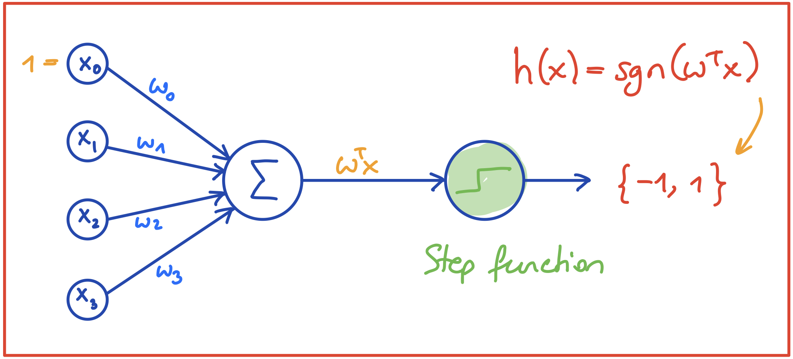

## Kurze Übersicht

### Formalisierung
*   Ausgabe $y$ ist reelle Zahl aus einem stetigen Bereich (zum Beispiel Hauspreis)
*   Die **Hypothesenfunktion** ist eine gewichtete Summe der Merkmale $x_i$ plus eine Konstante $w_0$:
    $$ h(\mathbf{x}) = \mathbf{w}^T\mathbf{x} = w_0 + w_1x_1 + w_2x_2 + ... + w_nx_n $$
*   Der **Verlust** (engl. loss) für einen Datenpunkt $ \mathbf{x} $ ist das **Fehlerquadrat**: 
    $$ \mathcal{L} = (\hat{y} - y)^2 = (h(\mathbf{x}) - y)^2 $$
*   Die Kosten (engl. cost) sind der durchschnittliche Verlust über alle Datenpunkte:
    $$ J = \frac{1}{2m} \sum_{i=1}^{m} (\hat{y} - y)^2 = \frac{1}{2m} \sum_{i=1}^{m} (h(\mathbf{x}) - y)^2 $$

### Der Gradient
*   Der **Gradientenvektor** $\nabla J(\mathbf{w})$ setzt sich zusammen aus den partiellen Ableitungen der Kostenfunktion $J$ nach den Gewichten $w_i$ und zeigt in jedem Punkt $\mathbf{w}$ in die **Richtung des steilsten Aufstiegs**:
    $$ \nabla J = [ \partial J / \partial w_0 
    \quad \partial J / \partial w_1 \quad ... 
    \quad \partial J / \partial w_n]^T $$
*   **Schlussfolgerung**: in die entgegengesetzte Richtung, i.e. in Richtung $-\nabla J(\mathbf{w})$ geht es am *steilsten bergab!* 
*   **IDEE**: Bewege $\mathbf{w}$ in Richtung $-\nabla J(\mathbf{w})$, um die Kosten $J$ möglichst schnell zu senken.

### Der Gradientenabstieg (engl. Gradient Descent)
1.   Starte mit zufälligen Gewichten $\mathbf{w}$
2.   Berechne den Gradientenvektor im aktuellen Punkt $\mathbf{w}$
3.   **Gewichtsaktualisierung**: Gehe einen *kleinen* Schritt in Richtung $-\nabla J(\mathbf{w})$
    $$ \mathbf{w} _{neu} := \mathbf{w} _{alt} - \alpha \cdot \nabla J(\mathbf{w} _{alt}) $$
    ($\alpha$: Lernrate/Schrittweite).
4.  Wiederhole Schritte 2-3, bis das globale Minimum von $J$ erreicht ist. 

### Graphische Übersicht
*   Lineare Regression
    
*   Perzeptron
    