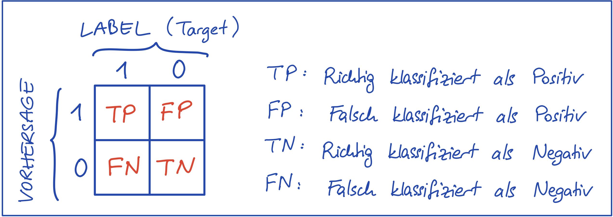

## Kurze Übersicht

### Performanzmetriken für Klassifizierungsprobleme

#### Wahrheitsmatrix (engl. Confusion Matrix)
*   Gibt eine Übersicht über die Anzahl von richtig und falsch klassifizierten Datenpunkten (bei binärer Klassifizierung)
    *   $TP =$ # True Positives $=$ Anzahl richtiger 1-Vorhersagen
    *   $FP =$ # False Positives $=$ Anzahl falscher 1-Vorhersagen
    *   $FN =$ # False Negatives $=$ Anzahl falscher 0-Vorhersagen
    *   $TN =$ # True Negatives $=$ Anzahl richtiger 0-Vorhersagen
*   Bei Klassifizierungsproblemen mit $N$ Klassen hat man eine $N \times N$ Matrix, die in Position $(i,j)$ die Anzahl der Klasse-$j$-Beispiele enthält, die als Klasse-$i$ vorhergesagt wurden.

#### Treffergenauigkeit (engl. Accuracy)
*   Anzahl richtig klassifizierter Datenpunkte, Erfolgsrate (engl. correct rate)
    $$Accuracy = \frac{TP+TN}{TP+TN+FP+FN}$$

*   Accuracy vermittelt ein falsches Bild des Erfolges bei unausgewogenen Datensätzen \
    Beispiel:
    *   Klasse 1 hat 10, Klasse 0 hat 990 Beispiele.
    *   Ein Modell, das immer 0 ausgibt, hat $990/1000 = 0.99$ Treffergenauigkeit, ist aber offensichtlich kein gutes Modell!

#### Precision

*   Positive Predictive Value (PPV)
*   Antwort auf: Von allen **positiven Vorhersagen**, wie viele sind richtig?
    $$Precision = \frac{TP}{TP + FP}$$
*   Wahrscheinlichkeit, dass ein positiv klassifiziertes Beispiel auch tatsächlich positiv ist.
*   Je näher an 1, desto besser.
*   Accuracy of **positive predictions**.

#### Recall

*   True Positive Rate, auch Sensitivität (engl. Sensitivity)
*   Antwort auf: Von allen **positiven Beispielen**, wie viele wurden richtig klassifiziert?
    $$Recall = \frac{TP}{TP + FN}$$
*   Wahrscheinlichkeit, dass ein positives Beispiel tatsächlich als solches erkannt wird.
*   Je näher an 1, desto besser.
*   Accuracy of **positive examples**.

#### Precision-Recall Trade-off
*   Ein gutes Modell sollte hohe Precision und zugleich hohes Recall haben.
*   Man kann die Precision eines Modells beliebig erhöhen (durch das Vergrößern des Schwellenwertes bei der Klassifizierung), jedoch wird dabei der Recall abnehmen.
*   Genau so kann man den Recall eines Modells beliebig erhöhen (durch das Verkleinern des Schwellenwertes bei der Klassifizierung), jedoch wird dabei die Precision abnehmen.
*   Es gilt ein gutes Trade-off zu finden.
*   Eine Zwei-Zahlen-Metrik erschwert den Entscheidungsprozess bei Evaluierung und Modellauswahl.

#### $F_1$-Score (Harmonisches Mittel)

*   Fasst Precision (P) und Recall (R) in einer Metrik zusammen (Harmonisches Mittel von P und R):
    $$F_1-Score = \frac{2}{\frac{1}{P} + \frac{1}{R}} = 2 \cdot \frac{PR}{P + R}$$
*   Der $F_1$-Score wird nur dann hoch sein, wenn P und R beide hoch sind.
*   Je näher an 1, desto besser.
*   Sehr kleine P und R Werte ziehen den $F_1$-Score sehr stark herunter. In dieser Hinsicht gibt diese Metrik ein akkurates Bild über den Erfolg eines Modells.
