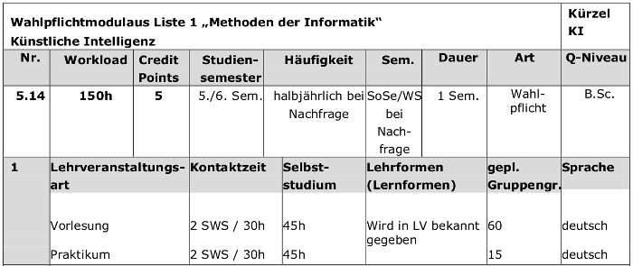

## Worum geht's hier?

[Quelle: [AvB - RoboCup 2013 - Eindhoven](https://www.flickr.com/photos/80267257@N05/10151827605) by [RoboCup2013](https://www.flickr.com/photos/80267257@N05) on Flickr.com ([CC BY 2.0](https://creativecommons.org/licenses/by/2.0/?ref=ccsearch&atype=rich))]{.origin}

### Was ist *Intelligenz*? Was ist *künstliche Intelligenz*?

*   Wie baut man intelligente Systeme?
*   Was braucht man für "Cmdr. Data"?
*   Welche Teilgebiete existieren?
*   Welche Methoden und Algorithmen gibt es?
*   Wie funktionieren die?

### Ziele

*   Hineinschnuppern in fast alle Fächer des "Apothekenschranks":
    Wie funktioniert's, wozu ist es gut?
*   **Methoden-Baukasten** zur Lösung unterschiedlichster Probleme
*   Grundlegendes Verständnis für Anwendungen in Spielen, Navigation, Planung,
    smarten Assistenten, autonomen Fahrzeuge

## Überblick Modulinhalte

1)  Problemlösen
    *   Zustände, Aktionen, Problemraum
    *   Suche (blind, informiert): Breiten-, Tiefensuche, Best-First,
        Branch-and-Bound, A-Stern
    *   Lokale Suche: Gradientenabstieg, Genetische/Evolutionäre Algorithmen (GA/EA)
    *   Spiele: Minimax, Alpha-Beta-Pruning, Heuristiken
    *   Constraints: Backtracking, Heuristiken, Propagation, AC-3

`<!--  -->`{=markdown}

2)  Maschinelles Lernen
    *   Merkmalsvektor, Trainingsmenge, Trainingsfehler, Generalisierung
    *   Entscheidungsbäume: CAL2, CAL3, ID3, C4.5
    *   Neuronale Netze
        -   Perzeptron, Lernregel
        -   Feedforward Multilayer Perzeptron (MLP), Backpropagation,
            Trainings- vs. Generalisierungsfehler
        -   Steuerung des Trainings: Crossvalidierung, Regularisierung
        -   Ausblick: Support-Vektor-Maschinen
    *   Naive Bayes Klassifikator

`<!--  -->`{=markdown}

3)  ~~Inferenz, Logik~~ (**entfällt im W21**)
    *   Prädikatenlogik: Modellierung, semantische und formale Beweise,
        Unifikation, Resolution
    *   Ausblick: Anwendung in Prolog

`<!--  -->`{=markdown}

Weitere relevante KI-/ML-Themen werden in weiteren Modulen behandelt:

*   Bilderkennung und unüberwachte Lernverfahren sind Gegenstand im Wahlfach
    "Mustererkennung / Bildverarbeitung" im Bachelor, Prof. König
*   Fortgeschrittene Themen wie Maschinelles Lernen und Neuroinformatik,
    Spracherkennung, Textmatching, probabilistisches Schließen, Reinforcement
    Learning und unüberwachte Lernverfahren sind u.a. Gegenstand der
    Wahlmodule "MML" (Prof. Gips / Prof. König) und "IR & NLP" im Master (Prof. Gips)

## Erwartungen an Sie

*   FHB: 90h Selbststudium => ca. 6h Arbeitszeit pro Woche!
*   TDU: 106h Selbststudium => ca. 7h Arbeitszeit pro Woche!

Zeiten sind Richtwerte! -- Manche brauchen länger, manche sind schneller ...

Die Praktikumsaufgaben sollen Ihnen helfen, sich mit den Inhalten der
Vorlesung auseinander zu setzen. Die Abgabeform und die Bedingungen an das
Testat sind bewusst so gewählt, damit Sie im Praktikum untereinander in eine
Diskussion eintreten (können). Nutzen Sie diese Chance und verhalten Sie sich
aktiv -- so macht das Praktikum Spaß und bringt allen mehr.

Studieren Sie! Studieren bedeutet, sich **selbstständig** mit einem Thema
auseinander zu setzen, zu vertiefen, zu üben, Zusammenhänge herzustellen.
Die Lehrveranstaltung unterstützt Sie dabei, indem die wichtigsten Themen
ausgesucht, in eine zeitliche Reihenfolge gebracht und didaktisch aufbereitet
werden, so dass Sie sich die Inhalte leichter erschließen können. Es gibt
aber viele weitere Themen und Dinge, die nicht besprochen werden können (schon
aus rein zeitlichen Gründen), die aber (für Sie und/oder das Themengebiet)
interessant sein können!

Prüfungsrelevant sind selbstverständlich nur die besprochenen Inhalte. Der
Fokus liegt aber auf dem "Können", also dem **Beherrschen** der jeweiligen
Themen.

## Kognitive Stufen -- Einordnung Lernziele

Kennen (K1)
:   Abruf von Informationen (Begriffe, Fakten, Prinzipien)
:   (erkennen, nennen, bezeichnen, wiedergeben, kennen)

Verstehen (K2)
:   Begründen und Erläutern von Aussagen zum Thema
:   (beschreiben, zusammenfassen, vergleichen, klassifizieren, begründen, erklären)

Anwenden (K3)
:   Übertragung von erworbenem Wissen auf neue Situationen oder Anwendung zur Problemlösung
:   (ausführen, anwenden, beurteilen, entwerfen, nutzen)

Nach *Anderson, Krathwohl (eds)*: "A Taxonomy for Learning, Teaching, and
Assessing: A Revision of Bloom's Taxonomy of Educational Objectives",
Allyn & Bacon, 2001
